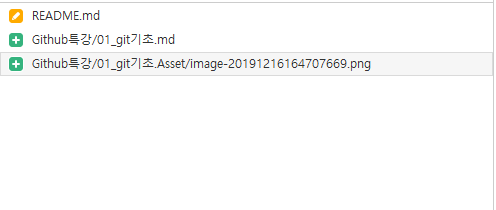

# Git 기초

## 개념

### SCM 이란?

Source Code Manager 의 약자로 , 코드의 버전을 관리하기 위해 존재한다.

### Git

git 은 Linus Torvalds 가 만든 SCM 으로  ,  현재 가장 많이 사용한다.

### Github

github 은 , git 이 관리하는 Repo 의  원격저장소를 제공하는 서비스다. 가장 많이 사용하여, 오픈소스 프로젝트들이 성장하는 곳이다.

## Sourcetree

> | 명령어   | 설명   | 예시      |
> | -------- | ------ | --------- |
> | git.inti | 초기화 | >git.init |
>
> 

## Clone

git remoterepo는 download가 아니라 Clone 해야한다.