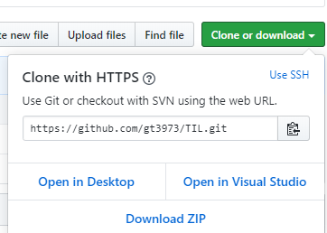
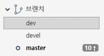

# Git 중급

### Clone

1. 다른 로컬 컴퓨터에서 받으려면 github에서 Clone을 함 (download 는 .git 생략)

2. 공부한 내용을 푸쉬 

3. 다른 로컬 컴퓨터에서 풀

4. 반복.

   

## Branch

### 

독립적으로 개발을 진행할 수 있는데, 이렇게 독립적으로 개발하는 것이 브랜치다.


## 크리스 마스 트리 만들기

```python
tree = '나무'
#len(tree) => 2
bulb = '전구'
deco = '장식'

while len(tree)<20:
    tree = tree+ bulb +deco
    
christmas_tree = tree
print(christmas_tree)
```


